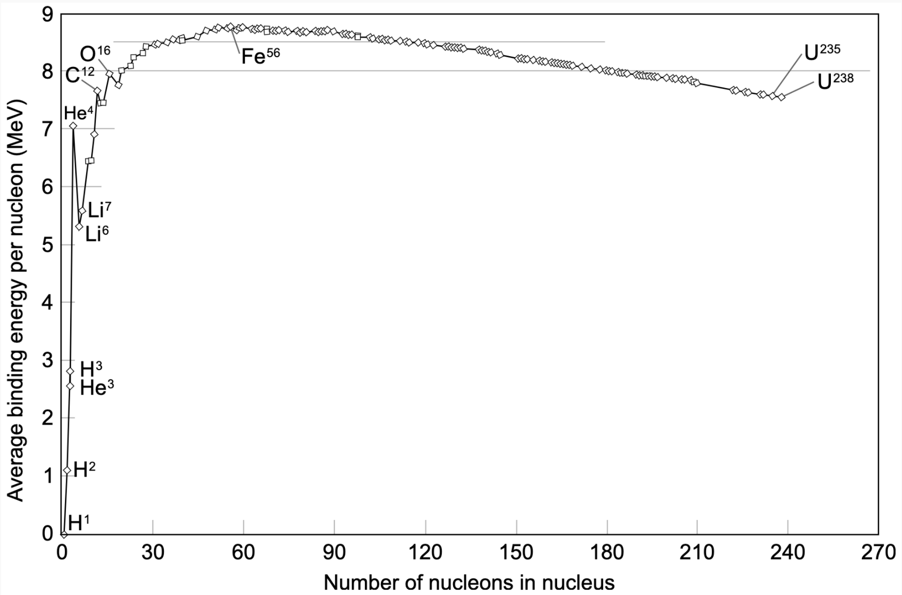

Before we even look at the problems the field is facing, we need to understand the basics. 

## What is fusion?

First, let me tell you a story of how my cat and I did nuclear fusion together (kind of).

Last week, my cat was mad at me because I had forgot to feed him. To make amends, I tried to pet him, but he kept on running away. Eventually, I cornered my kitty and rubbed his belly and at this point, sparks flew. My cat had missed his belly rubbing so much that he purred so loud the neighbours thought I had a motorcycle running in my house. And now, he's my BFFFL (Best Feline Friend For Life). 

This is basically how fusion works (but with less cuteness unfortunately): 

- We're forcing two positively charged hydrogen isotopes close together until they fuse and release energy
- Initially, the isotopes repulse each other because of the Coulomb Force
- But eventually, after forcing the isotopes to be a certain distance apart, they overcome the repulsion and are attracted to each by the Nuclear Strong Force
- This force causes the isotopes to fuse together and release immense amounts of energy

Similar to how my kitty didn't want to be near me and ran away when I approached him (the Coulomb force) but after getting close enough to him (Coulomb Barrier) and rubbing his belly, he's now inseparable from me (Nuclear Strong Force).

Enough story time, let's get into the details of how fusion works. 

This graph is the **Binding Energy Curve** and it shows us why hydrogen isotopes are used in fusion.

**Binding Energy is the amount of energy that is released when we split apart the protons and neutrons (called the nucleons) in a nuclei.** The more binding energy a nuclei has, the more tightly bound its nucleons are. 

Starting from the left of the curve we can observe some trends: As the number of nucleons increases, the binding energy of those nuclei increases. Therefore, nuclei with more nucleons require more binding energy than lighter nuclei. This is the case, until we reach nuclei that have the maximum amount of binding energy. 

At the peak of the curve, $Ni^{62}$ has the most binding energy followed by $Fe^{58}$ and $Fe^{56}$. After $Fe^{56}$, this trends reverses. Instead, the nuclei with less nucleons have the greater binding energy. You may be wondering why? As the nuclei are increasing in binding energy, they're also increasing in the total disruptive electric force, this force is caused by positively charged protons repelling other protons. And since the number of protons in the nuclei is increasing as nuclei move from left the right on the curve, this disruptive force is also increasing. Past $Fe^{56}$, the disruptive electric force is so great that it outweighs the binding energy and the trend then reverses. 

Two of the most common nuclei used in fusion are Deuterium (known as $H^2$) and Tritium (known as $H^3$). If we look at where $H^2$ and $H^3$ are on the curve, we can see that they have low binding energy because of their small atomic mass. **Elements with low binding energies are capable of producing immense amounts of energy when fused together.** Before I explain why this is the case, we're going to have to understand what the Coulomb Force and the Nuclear Strong Force are**.** These two forces determine the shape of the binding energy curve, and thus, play a huge role in fusion. 

### Coulomb Force

**The Coulomb Law states that like charges repel, and unlike charges attract. Recall that in fusion, we're trying to get two nuclei that are both positively charged as close as possible so that they can fuse.** The Coulomb Force tells us how much repulsive or attractive force is present between the two charged nuclei as they get closer and closer together. Using the equation below, we can calculate the magnitude of the Coulomb Force. 

$$F_k= \frac{k_2Q_1Q_2}{r^2}$$

$F_k$  Coulomb Force 

$Q_1$  Charge 1 

$Q_2$ Charge 2 

$r^2$  Distance between charged particles 

$k_2$  Coulomb constant 

$k = \frac {1}{4 \pi \epsilon_0}$, $\epsilon_0$ is the electric vacuum permittivity 

The equation shows that **as we bring two positive nuclei together, the repulsive Coulomb force between them increases the closer they are.** Now we can start to understand why fusion is difficult, we're bringing two particles that don't want to be close to each other, closer and closer together, therefore increasing the repulsive force between the two. At a certain distance between two hydrogen isotopes called the Coulomb Barrier, the nuclei are close enough that an attractive force called the Nuclear Strong Force can fuse the two nuclei together and overcome the Coulomb force. 

### Nuclear Strong Force

**The Nuclear Strong Force is an attractive force that binds together the nucleons (protons and neutrons) in a nuclei. In fusion, it brings the two positive nuclei closer together once the Coulomb Barrier is passed, allowing the nuclei to fuse.** It's an incredibly strong force, hundreds of times stronger than electromagnetism, and is present at distances smaller than $10^{-14}$ metres. Protons and neutrons experience this force almost identically. 

In fact, the Nuclear Strong Force is one of the four fundamental forces that governs the universe: the electromagnetic force, the gravitational force, the weak force (responsible for decay) and the strong force. 

### Why the Binding Energy Curve matters

We know that tons of energy can be released when combining two light nuclei, now let's understand why this is the case by fusing Deuterium and Tritium. 

If we were to combine $H^2$ (Deuterium) and $H^3$ (Tritium), we would see the following reaction: 

 $\ce{^{2}_{1}H} \space + \ce{^{3}_{1}H} \rightarrow \ce{^{4}_{2}He} \space + \ce{^{1}_{0}n} \space + 17.6MeV$. 

If you add up all the subscripts, the left and right side equal each other. n represents the number of neutrons $\ce{^{n}Z} \space$and atomic masses and m represents the number of protons$\ce{^_{m}Z} \space$. When we fused Deuterium and Tritium, we got a Helium4 nuclei and a neutron. Now let's look at where everything is on the Binding Energy Curve. 

In red, we can see the $H^2$ nuclei and the $H^3$ nuclei that are being fused together, and the product of their reaction $He^4$. What do you notice about $He^4$? The binding energy is far greater than the binding energies of both $H^2$ and $H^3$.

**When we combine two nuclei that have lower binding energies, to create a nuclei with higher binding energy, we are releasing energy.** Likewise, when we breakdown a large nuclei like $U^{236}$ into smaller elements, the products of that reaction are nuclei with higher binding energies so energy is released. 

What I just described is fusion and fission. **Fusion is the fusing of two light nuclei with lower binding energies into a larger nuclei with greater binding energy, thus releasing energy.** Fission is the breaking apart of a larger nuclei with lower binding energy, into nuclei with greater binding energy, thus releasing energy. 

We can split the energy binding curve into two parts from $Fe^{56}$.

Therefore, a general equation for fusion can be 

$X + Y \rightarrow Z + \Delta Q$

Where, $X$ and $Y$ are light nuclei before $Fe^{36}$ on the binding energy curve, $Z$ is the larger nuclei produced and $\Delta Q$ is the energy produced.

If you're interested in learning about the most researched nuclei used in fusion, check out a quick summary I wrote on them <a href="reactions.html">here</a>

### What Makes Fusion Difficult

So far, we know that fusion is initiated by the Nuclear Strong Force that acts at very short range distances ($10^{-15}$m). We also know that the Coulomb Force increases as two positively charged nuclei are brought closer and closer together until they reach a distance of $10^{-15}m$ between each other where the Nuclear Strong Force overtakes the Coulomb Force and fuses the two nuclei. 

If the Coulomb Force is preventing us from bringing the two hydrogen isotopes together, how the heck are we going to bring the isotopes $10^{-15}m$ away from each other? This is called the Coulomb Barrier — it's the exact point at which the strong force overtakes the Coulomb Force allowing some of the nuclei to fuse. 

Coulomb Barrier - Source: Introductory Nuclear Physics by Kenneth Krane

**This graph shows us the Coulomb Barrier at distance $a$ on the x-axis**, let's break it down. 

The x-axis shows us the distance that separates the two nuclei that we're trying to fuse and the y-axis shows the potential force. The positive region $V_0$ represents the replusive Coulomb potential and $-V_0$ represents the attractive Nuclear potential. The Coulomb potential scales with distance $\frac{1}{r}$ which means that as we bring the two nuclei closer, the nuclei will repulse each other more.  

**If the two nuclei can get to a distance $a$ apart, the Nuclear Strong Force overtakes the Coulomb Force and the two nuclei will fuse.** But before we can get to this distance, we need to overcome the increasing Coulomb Force. For the nuclei to reach a distance $a$ apart, we'll need to send them at an energy that is equal to the height of the Coulomb Barrier. If the nuclei don't have enough energy to resist to repulsive Coulomb potential, then the particles will be sent far away from each other again and won't fuse. 

 We can calculate the amount of energy required with this formula: 

$$V_c = \frac {e^2}{4\pi \epsilon_0}\frac{Z_a Z_b}{R_a + R_b}$$

$Z$ represents the number of protons the nuclei has or the atomic number

$R$ represents the radi of the nuclei 

The other terms we see are from Coulomb's Law, check [here](-rate-of-fusion.html) for a refresher. 

This equation once again shows why light nuclei like hydrogen isotopes are the best option for fusion, they experience less repulsive Coulomb Force because they only have 1 proton. In the equation for the Coulomb Barrier Height, we can see that as the number of protons increases in a nuclei the height of the Coulomb Barrier will also increase. 

**For Deuterium-Tritium fusion, $V_c$ is typically $0.4MeV$ which is way above the energy of a typical nuclei colliding within a reactor**.

If we want fusion to occur, the nuclei will need to be WAY MORE energetic. 

Thankfully, **the actual required temperature to surpass the Coulomb Barrier is a bit lower because of quantum tunnelling.** Quantum Mechanics tells us that there's a *small* non-zero probability that a nuclei will tunnel through the Coulomb Barrier despite not having enough energy to get past that barrier. Meaning that fusion can occur *sometimes*, even without the amount of energy required to get past the Coulomb Barrier. We'll look at calculating this probability in the future. 

Another factor that helps us is that the average kinetic energy of the particles doesn't need to be 0.4MeV, only some of the nuclei need to have this much energy. That means that the average kinetic energy of the particles can be lower than 0.4MeV, and those that are 0.4Mev will allow fusion to occur. 

The Maxwell Boltzmann Distribution shows us the distribution of energies of various nuclei in a reactor. The nuclei in red at the end of the curve are the ones that have the most energy and thus are the most likely to pass the Coulomb Barrier and fuse. 

 

Maxwell Boltzmann Distribution Source: University of Cambridge Dr. Tina Potter

---

**RECAP**

Let's do a recap just to review any information you might've missed: 

- Fusion is the combining of two hydrogen isotopes, often Deuterium and Tritium, to release an immense amount of energy
- Binding energy is the amount of energy released when a nuclei is separated into its constituents
- The binding energy curve and $E=mc^2$ shows that combining two light nuclei into a nuclei with a higher binding energy releases LOTS of energy
- The Coulomb Force, a repulsive force between two like charged particles, prevents nuclei from fusing and increases the closer and closer the two nuclei get together
- At a certain distance called the Coulomb Barrier, the Nuclear Strong Force overtakes the Coulomb Force and allows fusion to occur. It's an attractive short range forces that binds the nucleons (protons and neutrons in a nucleus together)
- For a particle to overcome the Coulomb Barrier, an immense amount of energy measured by the Coulomb Barrier's height is needed. Sometimes, particles can tunnel through the barrier without enough to energy. Even so, this is what makes fusion difficult.

If you enjoyed reading this, check out [Part 2] (https://www.briannagopaul.com/fusion-rate.html)
on the Rate of Fusion.

---

**References:**

- *Freidberg, J. (2007). Plasma Physics and Fusion Energy. Cambridge: Cambridge University Press. doi:10.1017/CBO9780511755705*
- *Chen, Francis F. “An Indispensable Truth.” (2011)*
- *Krane, Kenneth S, and David Halliday. Introductory Nuclear Physics. New York: Wiley, 1988. Print.*
- *SULI PPL Lectures* 
- *[Nuclear Fusion Hyperphysics](http://hyperphysics.phy-astr.gsu.edu/hbase/NucEne/fusion.html#c1)*

---
